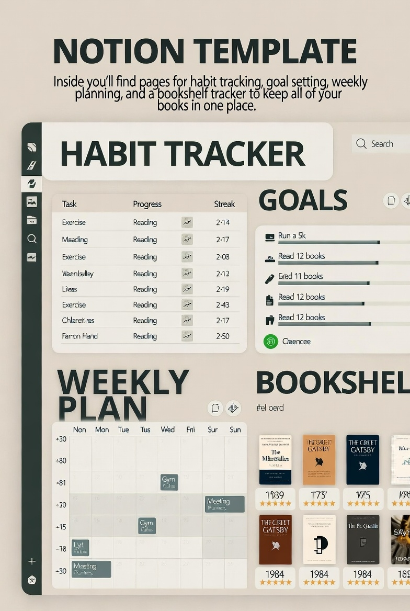

# 🌌 Sarah's Notion Template Generator

A comprehensive life design workspace template that helps you organize and track all aspects of your life.  

This project uses the **Notion API** to generate a fully functional, customizable template with Python.  

The template includes:  
✅ **The Ultimate Habit Tracker** - Track daily and weekly habits  
📆 **The Ultimate Goal Tracker** - Set and track long-term and short-term goals  
📔 **My Weekly Review** - Weekly reflection and planning  
📚 **Bookshelf Tracker** - Organize your reading list and book insights  
🎓 **Student Tracker** - Manage courses, assignments, and academic progress  

---

## **🚀 Why Code Your Notion Templates?**  

Before diving into the technical steps, let's talk about **why this is worth your time**:  

- ✅ **No More Manual Copy-Pasting** – Automate your workflow.  
- ✅ **Scalability** – Generate multiple pages dynamically.  
- ✅ **Adaptability** – Modify templates dynamically via API.  
- ✅ **AI and External Integrations** – Extend Notion’s power with APIs.  

Instead of **spending time recreating templates**, imagine **running a single command** and having an entire **structured workspace ready**.  

---  

## **1️⃣ Setting Up the Notion API**  

### **Step 1: Create a Notion Integration**  
To use the API, you need to **create an internal integration** in Notion.  

- Go to the **[Notion My Integrations Page](https://www.notion.so/my-integrations)**.  
- Click **"New Integration"** and give it a name (e.g., `"Template Generator"`).  
- Copy the **Internal Integration Secret**—this is your API key.  

### **Step 2: Ensure the Template is in the Same Workspace**  
We ran into issues when creating a new Notion template that **wasn't in the same workspace as the API integration**.  
- Click the **Notion logo (top-left corner)** and select **the same environment where you created the integration**.  
- Create a **new page** under this workspace before running your API script.  

If you don’t do this, your API might return a `404 object_not_found` error because it doesn’t have access to pages outside its workspace.  

### **Step 3: Assign the API Connection in Notion**  
We had to manually select the API **from a dropdown menu in Notion** before it could modify pages. You can do this in **two places**:  

1️⃣ **Share Button (Top Right Corner)**  
   - Click **"Share"** in the top-right corner of your Notion page.  
   - If your integration is visible, select it here.  
   - If it’s not listed, it might be restricted due to **Teamspace permissions**.  

2️⃣ **Three Dots (`⋮`) Menu (Top Right Corner)**  
   - Click the **three dots (`⋮`)** at the top right of the Notion page.  
   - Scroll down to **"Connections"**.  
   - Select your **API integration** from the dropdown.  
   - This ensures the API has the correct **access to modify pages**.  

### **Step 4: Share the Page with the Integration**  
- Open the Notion page where you want to **generate your template**.  
- Click **Share → Invite** and **add your integration** (if needed).  
- This **grants API permission** to modify that page.  

### **Step 5: Install Dependencies**  
Run this in your terminal:  

```bash
pip install -r requirements.txt
```  

Or install manually:

```bash
pip install requests
```  

This installs the `requests` library, which we'll use to **send API requests**.  

---  

## **2️⃣ Understanding Notion Page ID Formatting**  

There was some **confusion about Notion’s Page ID format**. Here’s the **correct way to get it**:  

1️⃣ Open your **target Notion page** in your browser.  
2️⃣ Copy the **URL** from the address bar.  
   Example:  
   ```
   https://www.notion.so/yourworkspace/Page-Name-1856236383b680ee877de0b6ee27ythu
   ```  
3️⃣ The **Page ID** is the last part:  
   ```
   1856236383b680ee877de0b6ee27ythu
   ```  

⚠️ **Important:** You don’t need to manually add dashes! When copied from the browser, the format is already correct for use in API requests.  

---  

## **3️⃣ Writing Your First Notion Template with Python**  

Now, let’s **write the script** to generate a structured Notion workspace.  

### **🚧 API Setup: Connecting to Notion**  
We start by defining our **API key** and **Notion Page ID**:  

```python
import requests

NOTION_API_KEY = "your_internal_integration_secret"
PARENT_PAGE_ID = "your_page_id"

url = "https://api.notion.com/v1/pages"
headers = {
    "Authorization": f"Bearer {NOTION_API_KEY}",
    "Content-Type": "application/json",
    "Notion-Version": "2022-06-28"
}
```  

This is the **foundation** of every API request.  

---  

## **4️⃣ Understanding the Template Structure**  

Sarah's Notion Template creates a **comprehensive life design workspace** with:  

✅ **The Ultimate Habit Tracker** - Daily and weekly habit tracking  
🎯 **The Ultimate Goal Tracker** - Long-term, short-term, and monthly goals  
📔 **My Weekly Review** - Weekly reflection and planning  
📚 **Bookshelf Tracker** - Reading list and book insights  
🎓 **Student Tracker** - Academic course management  

The template is generated using the Notion API. For a complete working implementation, see the `notion_template_generator.py` script which includes all the necessary API calls and structure.  

---

## **5️⃣ Running the Template Generator**

Now that you have everything set up, you can run the complete template generator!

### **Quick Start**

1. **Set up environment variables (optional but recommended):**
   ```bash
   export NOTION_API_KEY="your_internal_integration_secret"
   export NOTION_PARENT_PAGE_ID="your_page_id"
   ```

   Or create a `.env` file:
   ```
   NOTION_API_KEY=your_internal_integration_secret
   NOTION_PARENT_PAGE_ID=your_page_id
   ```

2. **Run the script:**
   ```bash
   python notion_template_generator.py
   ```

   If you haven't set environment variables, the script will prompt you for your API key and page ID.

3. **Success!** 🎉 Your Notion workspace template will be created automatically.

### **What Gets Created**

The script generates Sarah's complete Life Design Dashboard with:

- ✅ **The Ultimate Habit Tracker** - Daily and weekly habit tracking with checkboxes
- 🎯 **The Ultimate Goal Tracker** - Long-term, short-term, and monthly goal setting
- 📔 **My Weekly Review** - Weekly reflection prompts and planning section
- 📚 **Bookshelf Tracker** - Currently reading, want to read, and completed books
- 🎓 **Student Tracker** - Course management, assignments, deadlines, and grade tracking

### **Customization**

You can customize the template by editing the `build_complete_template()` method in `notion_template_generator.py`. The script includes helper methods for creating different block types:

- `create_heading()` - Headings of different levels
- `create_todo()` - To-do items
- `create_toggle()` - Collapsible toggle blocks
- `create_paragraph()` - Text paragraphs
- `create_bulleted_list()` - Bullet lists
- `create_dividing_line()` - Visual dividers

---

## **🏆 Final Thoughts**  

By coding Notion templates, you're **not just creating pages**—you're **building a system that grows with you**.  

Now, it's your turn. 🚀 What kind of **automated Notion setup** will you build?
